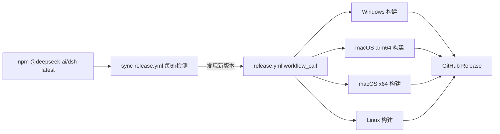

# deepseek-harness-pkg

参考 [n8n-pkg](https://github.com/hairyf/n8n-pkg) 为 [DeepSeek Harness](https://github.com/deepseek-ai/deepseek-harness)（`dsh`）制作的打包分发仓库。

思路与 n8n-pkg 一致：

- 以 pnpm 工作区的方式固定一个上游 npm 包版本（`@deepseek-ai/dsh`），通过 `patchedDependencies` 对依赖闭包中的包打补丁；
- GitHub Actions 在 Windows / macOS (arm64/x64) / Linux 上执行 `pnpm deploy` + `npm install --omit=dev`，产出各自平台的 `node_modules` 压缩包并发布为 GitHub Release。

## 目录结构

```text
.
├── .github/workflows/
│   ├── release.yml                 # 跨平台构建 + 发布 Release（可手动触发或被 sync 调用）
│   └── sync-release.yml            # 定时检测上游新版本，自动触发构建（自动同步）
├── scripts/
│   └── apply-dsh-web-app-patch.mjs # 幂等补丁脚本（换版本也能自动打上 LAN 开关补丁）
├── patches/                        # pnpm 补丁（patchedDependencies，固定版本可复现）
├── pnpm-workspace.yaml             # nodeLinker/构建脚本策略/patchedDependencies 等（pnpm 11 设置统一在此）
├── package.json                    # 固定 @deepseek-ai/dsh 版本
└── pnpm-lock.yaml                  # 锁文件
```

## 本地构建

要求：Node.js `>=22.19`（推荐 24）、pnpm `11.x`（仓库已声明 `packageManager: pnpm@11.7.0`）。

```sh
pnpm install            # 安装依赖并应用补丁
pnpm start              # 本地直接运行：dsh web（http://127.0.0.1:3080）
pnpm build              # 产出 prod 部署目录 build_dir/
```

## 发布

进入仓库的 Actions 页面，手动触发 **Build and Release DeepSeek Harness**：

- `dsh_version`：要打包的 dsh 版本，默认 `0.1.0-rc.6`（需与 `patches/` 中补丁所针对的版本匹配，否则构建会因补丁失配而失败）。

构建完成后会自动创建形如 `dsh-<版本>-<run_id>` 的 GitHub Release，附四个平台的 zip：

| 平台 | 产物 |
| --- | --- |
| Windows | `deepseek-harness-pkg-windows.zip` |
| macOS (Apple Silicon) | `deepseek-harness-pkg-macos-arm64.zip` |
| macOS (Intel) | `deepseek-harness-pkg-macos-x64.zip` |
| Linux | `deepseek-harness-pkg-linux.zip` |

## 使用产物

产物是自包含的 npm 项目（`node_modules` + `package.json` + `package-lock.json`）。解压后直接运行：

```sh
# Windows
node_modules\.bin\dsh.cmd web

# macOS / Linux
./node_modules/.bin/dsh web
```

首次使用需要配置模型提供方（API Key）等，见 [DeepSeek Harness 官方文档](https://github.com/deepseek-ai/deepseek-harness)。

## 补丁

### dsh-web-app：局域网访问（默认关闭）

上游 `dsh web` 出于安全考虑拒绝 `--host 0.0.0.0`（会向网络暴露远程代码执行面）。本仓库的补丁 `patches/dsh-web-app@0.1.0-rc.6.patch` 将其改为**显式环境变量开关**：

```sh
# 默认仍拒绝 0.0.0.0
dsh web --host 0.0.0.0            # error

# 明确知情后放开（危险：相当于把本机 RCE 暴露到网络）
DSH_PKG_ALLOW_LAN=1 dsh web --host 0.0.0.0 --trusted-host <局域网IP>:3080
```

> ⚠️ 安全警告：`--host 0.0.0.0` 会允许局域网任意设备访问你的会话与工具执行能力。仅建议在受信网络/内网环境使用，并配合 `--trusted-host` 限制 /api 信任域。

### 新增/更新补丁

```sh
pnpm patch @deepseek-ai/dsh-web-app   # 修改后 pnpm patch-commit 生成 .patch
```

随后在 `pnpm-workspace.yaml` 的 `patchedDependencies` 登记（注意版本号必须与锁文件解析结果一致）。升级 dsh 版本时，`patches/` 需要同步更新。


## 自动同步上游 Release

仓库内置 `sync-release.yml`：

- **触发**：每 6 小时定时检查一次；也可在 Actions 页手动触发（可指定 `version`，或用 `force=true` 强制重建）。
- **同步信号**：上游 `deepseek-ai/deepseek-harness` 目前不发布 GitHub Release，因此以 npm 的 `@deepseek-ai/dsh` `latest` 版本为准；发现新版本后自动以 `workflow_call` 调用 `release.yml`，无需手动点按钮，也无需配置 PAT。
- **补丁容错**：换新版本时，`patchedDependencies` 中旧版本的补丁条目会被 pnpm 忽略（`allowUnusedPatches: true`），构建产物中的 `dsh-web-app` 由 `scripts/apply-dsh-web-app-patch.mjs` 幂等打上 LAN 开关补丁——只要上游保留 `0.0.0.0` 拦截逻辑即可自动适配；若上游改动了相关代码，脚本会明确报错提示更新。
- **发布年龄门禁**：pnpm 11 默认会拒绝“太新”的依赖，已在 `pnpm-workspace.yaml` 用 `minimumReleaseAge: 0` 关闭，保证上游发布后立即可同步。`dangerouslyAllowAllBuilds: true` 允许新版本中未知的原生依赖执行构建脚本（与 n8n-pkg 的 `allow-scripts=true`、npm 默认行为一致）；若想收紧供应链，可换回显式 `allowBuilds` 名单。

工作流引用关系：



