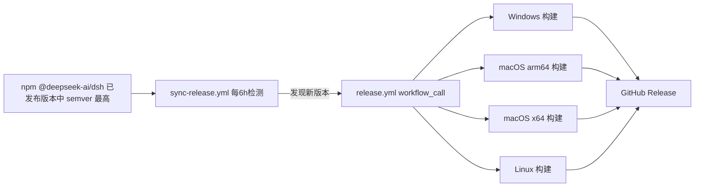

<p align="center">
  <a href="https://github.com/hairyf/deepseek-harness-pkg">
    
  </a>
</p>

<h1 align="center">DeepSeek Harness Pkg</h1>

<p align="center">
  <em><a href="https://github.com/deepseek-ai/deepseek-harness">DeepSeek Harness</a>（<code>dsh</code>）的跨平台预构建分发仓库 —— 固定上游版本、打补丁、由 GitHub Actions 自动同步构建。</em>
</p>

<p align="center">
  <a href="./README.md">English</a> · <strong>中文</strong>
</p>

<p align="center">
  
  
  
  
</p>

> **状态：开发者预览。** 上游 `dsh` 仍在快速迭代，常有破坏性变更；本仓库紧密跟进并自动重建。

## 这是什么？

[DeepSeek Harness](https://github.com/deepseek-ai/deepseek-harness)（`dsh`）是开源的 Agent 工作台，包含 CLI、Web UI 与插件架构。常规安装需要自己装 Node.js、pnpm 并从头构建。

本仓库（参考 [n8n-pkg](https://github.com/hairyf/n8n-pkg)）省掉这些麻烦：固定一个上游 npm 版本、对依赖闭包打补丁，并通过 GitHub Actions 产出 Windows、macOS（Apple Silicon + Intel）、Linux 三个平台可直接运行的 `node_modules` 压缩包。使用者只需从 [Releases](https://github.com/hairyf/deepseek-harness-pkg/releases) 下载对应平台的 zip，解压后运行 `dsh web` 即可。

## 特性

| | |
| --- | --- |
| **固定版本、可复现** | pnpm 工作区固定单个上游版本（`@deepseek-ai/dsh`），补丁记录在 `patches/`，锁文件一并提交。 |
| **补丁依赖闭包** | 通过 `patchedDependencies` 对依赖闭包内的包打补丁，包括 `dsh web` 的局域网访问开关。 |
| **跨平台产物** | CI 为 Windows、macOS（arm64 + x64）、Linux 构建压缩包并发布为 GitHub Release。 |
| **自动同步上游** | 定时工作流监听 npm 上新的 `dsh` 版本，发现后自动触发重新构建。 |
| **开箱即用** | 每个产物都是纯 npm 项目 —— 解压后直接运行 `node_modules` 里的 `dsh` 命令即可。 |

## 快速开始

1. 从 [Releases](https://github.com/hairyf/deepseek-harness-pkg/releases) 页面下载对应平台的产物。
2. 解压。
3. 运行：

```sh
# Windows
node_modules\.bin\dsh.cmd web

# macOS / Linux
./node_modules/.bin/dsh web
```

Web UI 会打开在 `http://127.0.0.1:3080`。首次使用需要在界面里配置模型提供方（API Key），详见 [DeepSeek Harness 官方文档](https://github.com/deepseek-ai/deepseek-harness)。

> 要求：Node.js `^22.19.0` 或 `>=24.0.0`。产物是纯 npm 项目，无需全局安装 pnpm。

## 目录结构

```text
.
├── .github/workflows/
│   ├── release.yml                 # 跨平台构建 + 发布 Release（可手动触发或被 sync 调用）
│   └── sync-release.yml            # 定时检测上游新版本，自动触发构建（自动同步）
├── scripts/
│   └── apply-dsh-web-app-patch.mjs # 幂等补丁脚本（换版本也能自动打上 LAN 开关补丁）
├── patches/                        # pnpm 补丁（patchedDependencies，固定版本可复现）
├── pnpm-workspace.yaml             # nodeLinker/构建脚本策略/patchedDependencies 等（pnpm 11 设置统一在此）
├── package.json                    # 固定 @deepseek-ai/dsh 版本
└── pnpm-lock.yaml                  # 锁文件
```

## 本地构建

要求：Node.js `>=22.19`（推荐 24）、pnpm `11.x`（仓库已声明 `packageManager: pnpm@11.7.0`）。

```sh
pnpm install            # 安装依赖并应用补丁
pnpm start              # 本地直接运行：dsh web（http://127.0.0.1:3080）
pnpm build              # 产出 prod 部署目录 build_dir/
```

## 发布

进入仓库的 Actions 页面，手动触发 **Build and Release DeepSeek Harness**：

- `dsh_version`：要打包的 dsh 版本，默认 `0.1.0-rc.6`（需与 `patches/` 中补丁所针对的版本匹配，否则构建会因补丁失配而失败）。

构建完成后会自动创建形如 `dsh-<版本>-<run_id>` 的 GitHub Release，附四个平台的 zip：

| 平台 | 产物 |
| --- | --- |
| Windows | `deepseek-harness-pkg-windows.zip` |
| macOS（Apple Silicon） | `deepseek-harness-pkg-macos-arm64.zip` |
| macOS（Intel） | `deepseek-harness-pkg-macos-x64.zip` |
| Linux | `deepseek-harness-pkg-linux.zip` |

## 补丁

### dsh-web-app：局域网访问（默认关闭）

上游 `dsh web` 出于安全考虑拒绝 `--host 0.0.0.0`（会向网络暴露远程代码执行面）。`patches/dsh-web-app@0.1.0-rc.6.patch` 补丁将其改为**显式环境变量开关**：

```sh
# 默认仍拒绝 0.0.0.0
dsh web --host 0.0.0.0            # error

# 明确知情后放开（危险：相当于把本机 RCE 暴露到网络）
DSH_PKG_ALLOW_LAN=1 dsh web --host 0.0.0.0 --trusted-host <局域网IP>:3080
```

> ⚠️ 安全警告：`--host 0.0.0.0` 会允许局域网任意设备访问你的会话与工具执行能力。仅建议在受信网络/内网环境使用，并配合 `--trusted-host` 限制 `/api` 信任域。

### 新增/更新补丁

```sh
pnpm patch @deepseek-ai/dsh-web-app   # 修改后 pnpm patch-commit 生成 .patch
```

随后在 `pnpm-workspace.yaml` 的 `patchedDependencies` 登记（注意版本号必须与锁文件解析结果一致）。升级 dsh 版本时，`patches/` 需要同步更新。

## 自动同步上游 Release

仓库内置 `sync-release.yml` 工作流：

- **触发**：每 6 小时定时检查一次；也可在 Actions 页手动触发（可指定 `version`，或用 `force=true` 强制重建）。
- **同步信号**：上游 `deepseek-ai/deepseek-harness` 目前不发布 GitHub Release，因此以 npm 的 `@deepseek-ai/dsh` 已发布版本为准；工作流通过 `scripts/resolve-latest-dsh-version.mjs` 取**已发布版本中 semver 最高者**（覆盖 `latest`、`next` 等所有 dist-tag，而不只是 `latest` —— 上游可能把新 rc 标在 `next` 上而 `latest` 仍是旧版）。发现新版本后自动以 `workflow_call` 调用 `release.yml`，无需手动点按钮，也无需配置 PAT。
- **补丁容错**：换新版本时，`patchedDependencies` 中旧版本的补丁条目会被 pnpm 忽略（`allowUnusedPatches: true`），构建产物中的 `dsh-web-app` 由 `scripts/apply-dsh-web-app-patch.mjs` 幂等打上 LAN 开关补丁——只要上游保留 `0.0.0.0` 拦截逻辑即可自动适配；若上游改动了相关代码，脚本会明确报错提示更新。
- **发布年龄门禁**：pnpm 11 默认会拒绝“太新”的依赖，已在 `pnpm-workspace.yaml` 用 `minimumReleaseAge: 0` 关闭，保证上游发布后立即可同步。`dangerouslyAllowAllBuilds: true` 允许新版本中未知的原生依赖执行构建脚本（与 n8n-pkg 的 `allow-scripts=true`、npm 默认行为一致）；若想收紧供应链，可换回显式 `allowBuilds` 名单。

工作流引用关系：



## 安全说明

- 本项目仅供个人学习、研究与测试使用，请勿用于商业用途。
- `dsh` 是具有**本地代码执行能力**的 Agent 工作台，请仅在可信、隔离的环境中使用，切勿导入来源不明的配置或插件。
- 局域网补丁（`DSH_PKG_ALLOW_LAN=1`）本身就有风险——仅建议在受信网络中使用。
- 开发者不对因使用本项目造成的数据丢失或安全问题负责。

## 相关项目

| 项目 | 用途 |
| --- | --- |
| [deepseek-harness](https://github.com/deepseek-ai/deepseek-harness) | 上游 `dsh`（CLI + Web UI + 插件架构） |
| [deepseek-harness-desktop](https://github.com/hairyf/deepseek-harness-desktop) | 一键桌面应用，消费本仓库产出的预构建包 |
| [n8n-pkg](https://github.com/hairyf/n8n-pkg) | 本仓库所参考的打包分发仓库 |

## 致谢

- [DeepSeek Harness](https://github.com/deepseek-ai/deepseek-harness) —— 上游项目
- [n8n-pkg](https://github.com/hairyf/n8n-pkg) —— 打包分发模式
- [pnpm](https://pnpm.io/) —— 工作区、补丁与部署工具
- [GitHub Actions](https://github.com/features/actions) —— 跨平台 CI 构建与发布
